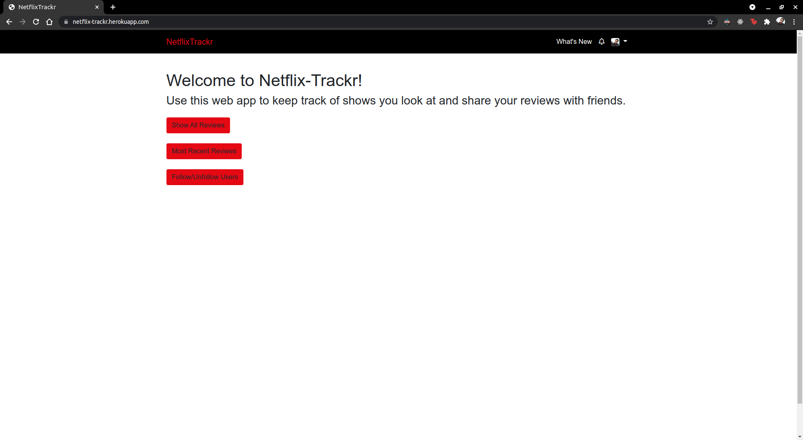

# Netflix-Trackr

[LIVE LINK](https://netflix-trackr.herokuapp.com/)

> A web app to keep track of shows you look at and share your reviews with friends.

Additional description about the project and its features.

## Built With

- [Ruby on Rails](https://rubyonrails.org/)

## Author

👤 **Ryel Banfield**

- GitHub: [@RyelBanfield](https://github.com/ryelbanfield)
- Twitter: [@RyelBanfield](https://twitter.com/ryelbanfield)
- LinkedIn: [Ryel Banfield](https://www.linkedin.com/in/ryel-banfield/)

## 🤝 Contributing

Contributions, issues, and feature requests are welcome!

Feel free to check the [issues page](issues/).

## Show your support

Give a ⭐️ if you like this project!

## Acknowledgments

- Hat tip to anyone whose code was used
- Inspiration
- etc

## 📝 License

This project is [MIT](LICENSE) licensed.